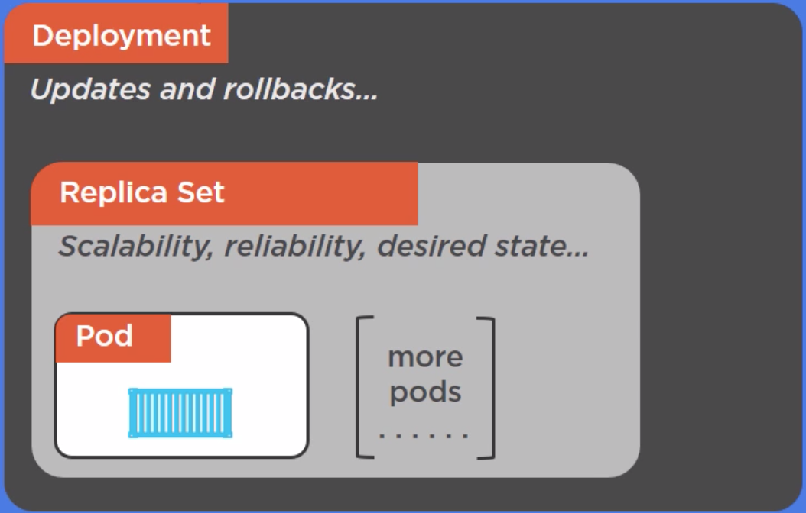
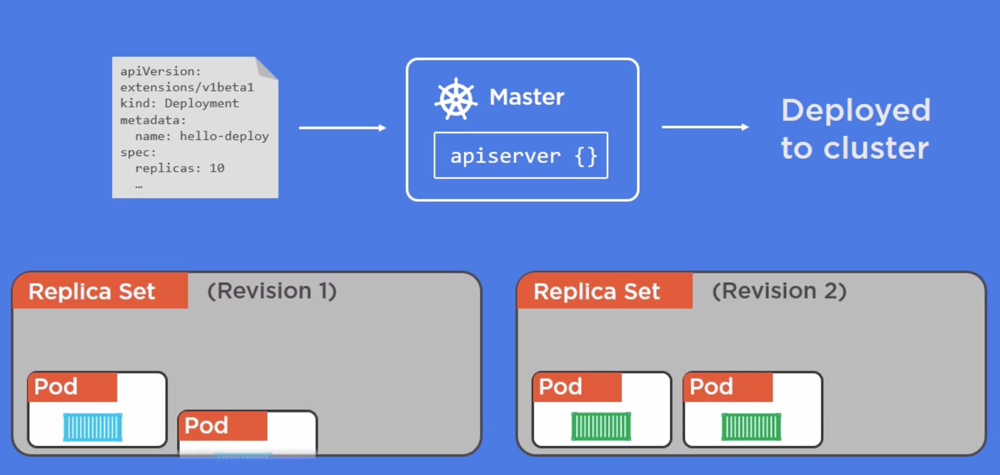

# Kubernetes Deployment
- Deployment is all about rolling update and seamless rollback
- ReplicationController is replaced by ReplicaSet
- Deployment manage ReplicaSet
- ReplicaSet manage Pod


## Old way to do rolling update
```
kubectl rolling-update -f update-rc.yml
```
## Using Deployment for rolling update

- It add one `Pod` in new ReplicaSet and removes one from old one
## Describe deployment
```
kubectl describe deploy hello-deploy --record
```
## Get list of replica set
```
kubectl get rs
```
# Updating deployment
```
kubectl apply -f deploy-update.yml
```
```
kubectl rollout status deployment hello-deployment
```
## Check rollout history
```
kubectl rollout history deployment hello-deploy
```
## Rollback Deployment
```
kubectl rollout undo deployment hello-deploy --to-revision=1
```